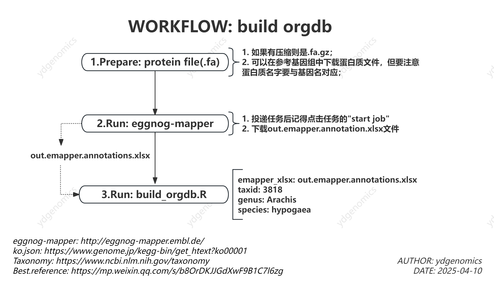

# T-peanut
This repository  stores some scripts of peanut project. 
---

1. build_orgdb

2. multi_find_markers
   [multi_find_markers.R](multi_find_markers_T-peanut.R)

3. enrich
   [enrich_T.R](enrich_T-peanut.R)

4. volcano_visual
   [volcano_visual.R](volcano_visual_T-peanut.R)